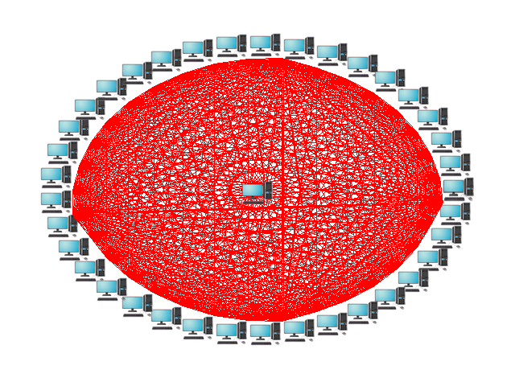

¡Bienvenido a la documentación de Don Clusterio!
===================================

**Lumache** (/lu'make/) is a Python library for cooks and food lovers
that creates recipes mixing random ingredients.
It pulls data from the `Open Food Facts database <https://world.openfoodfacts.org/>`_
and offers a *simple* and *intuitive* API.

Check out the :doc:`usage` section for further information, including
how to :ref:`installation` the project.

.. note::

   This project is under active development.

Contents
--------

.. toctree::
   :maxdepth: 1
   :caption: Install

   installation/fsl_mac_install

.. toctree::
    :maxdepth: 1
    :caption: Unix for Neuroimagers
    
    unix/Unix_Intro
    unix/Unix_01_Navigation
    unix/Unix_02_CopyRemove
    unix/Unix_03_ReadingTextFiles
    unix/Unix_04_ShellsVariables
    unix/Unix_05_ForLoops
    unix/Unix_06_IfElse
    unix/Unix_07_Scripting
    unix/Unix_08_Sed
    unix/Unix_09_AutomatingTheAnalysis
    
    
.. toctree::
    :maxdepth: 1
    :caption: fMRI Short Course with FSL
    
    fMRI_Short_Course/fMRI_Intro
    fMRI_Short_Course/fMRI_01_DataDownload
    fMRI_Short_Course/fMRI_02_ExperimentalDesign
    fMRI_Short_Course/fMRI_03_LookingAtTheData
    fMRI_Short_Course/fMRI_04_Preprocessing
    fMRI_Short_Course/fMRI_05_1stLevelAnalysis
    fMRI_Short_Course/fMRI_06_Scripting
    fMRI_Short_Course/fMRI_07_2ndLevelAnalysis
    fMRI_Short_Course/fMRI_08_3rdLevelAnalysis
    fMRI_Short_Course/fMRI_09_ROIAnalysis
    fMRI_Short_Course/fMRI_10_Summary
    fMRI_Short_Course/fMRI_Appendices

